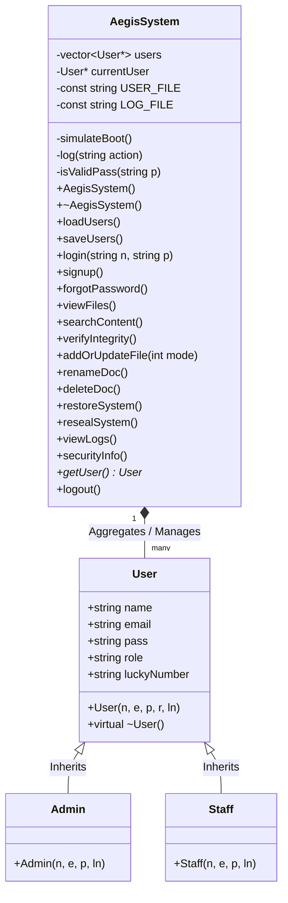

# Aegis Guardian

**Aegis Guardian** is an advanced, terminal-based Document Security and Management Operating System built entirely in C++. Designed as a secure vault simulation, it features Role-Based Access Control (RBAC), self-healing file integrity algorithms, and a sleek ANSI-colored Command Line Interface.

---

## Core Features

* **Role-Based Access Control (RBAC):** Strict separation of privileges. `STAFF` members can explore and read documents, while `ADMIN` accounts possess the authority to create, modify, delete, and restore system states.
* **Self-Healing Vault Integrity:** Every document created in the Vault is secretly mirrored. The Deep Scan Integrity feature checks byte-sizes to detect tampering, unauthorized modifications, or breaches.
* **Vim-Style Multi-Line Editor:** Create and append documents natively in the terminal with multi-line support, saving safely via `:wq` commands.
* **Disaster Recovery (Restore & Re-seal):** Admins can execute system-wide rollbacks to restore breached files from hidden backups, or "Re-seal" the entire OS to wipe all data securely.
* **Cryptographic-Style Authentication:** Secure login system with an integrated signup protocol. Includes a "Forgot Password" override utilizing a secure Lucky Number prompt.
* **Persistent Audit Logging:** Every system interaction—from logins to file deletions—is permanently logged in `audit.log` with an exact timestamp for administrative review.
* **Emergency Exit Protocol:** A globally active listener that instantly aborts the system safely if compromised.

---

## System Architecture (UML)

The system relies on a modular, object-oriented architecture. Below is the UML Class Diagram illustrating the structure and relationships of the core entities.



---

## OOP Concepts Applied

This project heavily implements the four core pillars of Object-Oriented Programming to ensure a secure, scalable, and memory-efficient codebase:

### 1. Encapsulation (Data Hiding)
Sensitive system data and helper functions are hidden from the outside world using the `private` access modifier inside the `AegisSystem` class.
* **Example:** Variables like `vector<User*> users` (the database of accounts) and `LOG_FILE` are private. The main program cannot alter them directly; it must use public interfaces like `signup()` or `login()` to interact with the data safely.

### 2. Inheritance
To promote code reusability, the system uses a hierarchical class structure for account types.
* **Example:** The `Admin` and `Staff` classes inherit from the base `User` class. Instead of rewriting properties like `name`, `email`, and `password` for every type of account, the derived classes simply inherit them and automatically pass their specific access level (`"ADMIN"` or `"STAFF"`) to the base constructor.

### 3. Polymorphism
The system handles different types of objects dynamically at runtime, specifically focusing on safe memory deallocation.
* **Example:** The base `User` class features a **Virtual Destructor** (`virtual ~User() {}`). When the `AegisSystem` shuts down and loops through its `vector<User*>` to delete objects, the virtual destructor ensures that C++ figures out at runtime whether it is destroying an `Admin` or a `Staff` member, preventing memory leaks.

### 4. Abstraction
Complex, low-level background operations are entirely hidden from the user interface.
* **Example:** When an admin chooses to restore the system, they simply call the public `sys.restoreSystem()` method. All the complex `<filesystem>` iterations, directory pathing, and byte-overwriting options are abstracted away behind that single, clean function call.

---

## Technical Stack
* **Language:** C++ (Requires C++17 or higher)
* **File Operations:** `<filesystem>`, `<fstream>`
* **UI/UX:** Native ANSI escape sequences for terminal colorization and formatting.
* **Encoding:** Enforced UTF-8 output (`windows.h`) to ensure cross-platform ASCII art rendering.

---

## Installation & Compilation

Ensure you have a C++ compiler (like GCC/MinGW) installed that supports at least C++17.

**1. Clone the repository:**
```bash
git clone https://github.com/Hadia-Aziz99/Aegis-Guardian.git
cd AegisGuardian
```

**2. Compile the source code:**
```bash
g++ main.cpp -o Aegis.exe -std=c++17
```

**3. Run the OS:**
```bash
.\Aegis.exe
```

---

## Default Credentials

On the very first launch, Aegis automatically generates a secure master administrative account (or you can use the built-in defaults):

* **Admin 1:** `admin` / `admin123`
* **Admin 2:** `adminrafay` / `rafay123`
* **Staff:** `staff` / `staff123`
* **Admin Secret Key:** `guardian2026` (For registration of new Admins)
* **Default Lucky Number:** `1`

*(Note: Custom passwords created via the Signup protocol must be strictly between 6 and 8 characters).*

---

## 👥 Group Members
* **Hadia Aziz**
* **Abdul Rafay**
* **Huda Tariq**
* **Faizan Iqbal**
